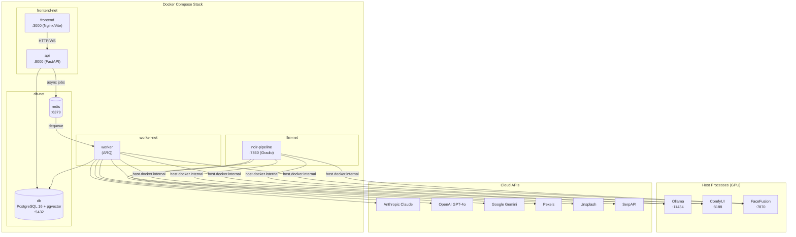
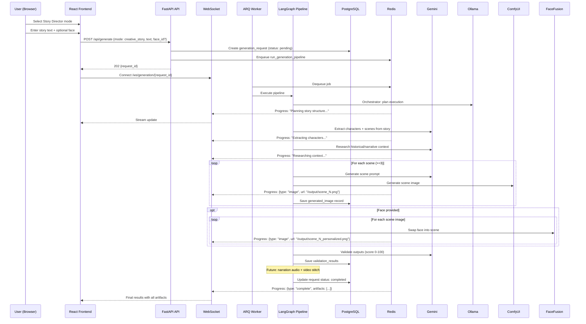
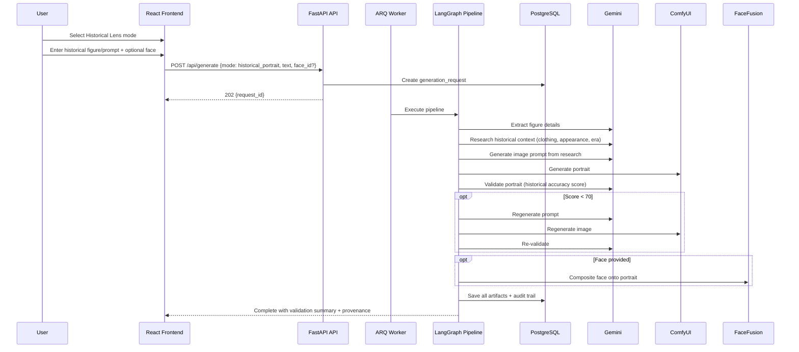
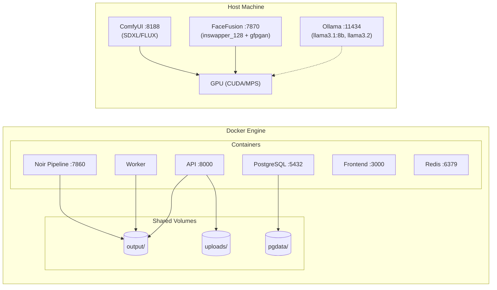

# Architecture Diagrams: ChronoNoir Studio

> Generated 2026-02-28 | Phase 2 Architecture

## 1. Docker Compose Service Topology

## 2. Data Flow: Journey J1 — Creative Storyteller Run

## 3. Data Flow: Journey J2 — Historical Portrait Run

## 4. Deployment Layout (Single Machine)

