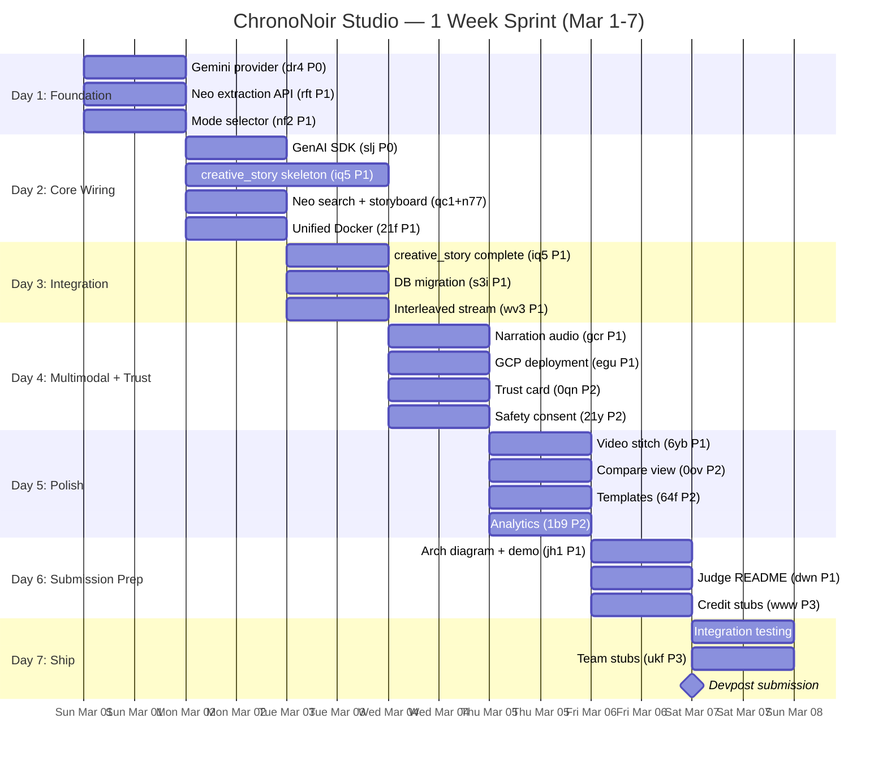

# Build Sequence: ChronoNoir Studio (1-WEEK SPRINT)

> Updated 2026-02-28 | Compressed to 7-day timeline (Mar 1-7)

## Approach: Maximum Parallelism + Scope Cuts

With 1 week, we run **5 parallel streams simultaneously** and cut P3 monetization to post-submission stubs only. Every day has a clear deliverable gate.

---

## Critical Path (compressed)

```
Day 1: dr4 (Gemini) + rft (Neo extraction) + nf2 (mode selector) — ALL PARALLEL
Day 2: slj (GenAI SDK) + iq5 (creative_story skeleton) + qc1/n77 (Neo APIs) + 21f (Docker)
Day 3: iq5 (complete) + s3i (DB migration) + wv3 (interleaved stream)
Day 4: gcr (narration audio) + egu (GCP deployment) + 0qn (trust card) + 21y (consent)
Day 5: 6yb (video stitch) + 0ov (compare view) + 64f (templates) + 1b9 (analytics)
Day 6: jh1 (arch diagram + demo recording) + dwn (README) + www (credit stubs)
Day 7: Integration testing + demo polish + submission package + ukf (team stubs)
```

---

## Day-by-Day Plan

### Day 1 (Mar 1): Foundation — 3 parallel tracks

| Stream | Bead | Task | Deliverable |
|--------|------|------|-------------|
| A: Compliance | **dr4** (P0) | Add Gemini provider to LLM router | Gemini calls work via google-genai SDK |
| B: Neo APIs | **rft** (P1) | Expose character extraction as importable module | `extract_characters()` callable from chrono-canvas |
| C: UX | **nf2** (P1) | Add mode selector to React frontend | Story Director / Historical Lens cards route to Generate |

**Day 1 gate:** Gemini generates text, Neo extraction importable, mode selector renders.

### Day 2 (Mar 2): Core Wiring — 4 parallel tracks

| Stream | Bead | Task | Deliverable |
|--------|------|------|-------------|
| A: Compliance | **slj** (P0) | Wire GenAI SDK into orchestration path | LangGraph routes to Gemini for extraction/research/prompt/validation |
| A: Compliance | **iq5** (P1) start | Add `creative_story` run type + storyboard LangGraph subgraph skeleton | POST /api/generate accepts mode=creative_story |
| B: Neo APIs | **qc1** (P1) | Expose image search as importable module | `ImageSearcher` callable from chrono-canvas |
| B: Neo APIs | **n77** (P1) | Expose storyboard assembly as importable module | `build_storyboard()` callable |
| C: UX | **21f** (P1) | Unified Docker Compose | Single `docker compose up` runs full stack |

**Day 2 gate:** creative_story endpoint exists, all Neo modules importable, unified Docker works.

### Day 3 (Mar 3): Pipeline Integration

| Stream | Bead | Task | Deliverable |
|--------|------|------|-------------|
| A: Compliance | **iq5** (P1) finish | Complete storyboard pipeline: extraction → search → prompt_gen × N → image_gen × N → validation → export | End-to-end creative_story run produces >=3 scenes |
| A: Integration | **s3i** (P1) | Migrate Neo data models to PostgreSQL (Alembic migration) | Characters/scenes/stories in Postgres |
| A: Compliance | **wv3** (P1) | Extend WebSocket for interleaved artifact milestones | Images stream to frontend as they generate |

**Day 3 gate:** Full storyboard run works end-to-end. Both modes functional.

### Day 4 (Mar 4): Multimodal + Trust — 4 parallel tracks

| Stream | Bead | Task | Deliverable |
|--------|------|------|-------------|
| A: Compliance | **gcr** (P1) | Add narration audio generation (Google Cloud TTS or local TTS) | Audio artifact per run |
| A: Compliance | **egu** (P1) | GCP deployment (Cloud Run or GKE) + artifact storage | Backend running on GCP |
| D: Trust | **0qn** (P2) | Build TrustCard component (validation score, steps, cost) | Trust card visible pre-export |
| D: Trust | **21y** (P2) | Add safety consent modal for face personalization | Consent blocks generation until accepted |

**Day 4 gate:** Audio narration works, GCP deployed, trust card renders, consent flow blocks correctly.

### Day 5 (Mar 5): Polish — 4 parallel tracks

| Stream | Bead | Task | Deliverable |
|--------|------|------|-------------|
| A: Compliance | **6yb** (P1) | Video stitch from panels + narration (ffmpeg montage) | Video artifact in export bundle |
| D: Trust | **0ov** (P2) | Compare view: original vs personalized, export selector | Side-by-side view works |
| C: UX | **64f** (P2) | Templates + onboarding (1 preset per mode, guidance copy) | New user can start from template |
| D: Analytics | **1b9** (P2) | Analytics instrumentation (9 events + properties) | Events fire on key actions |

**Day 5 gate:** Full multimodal output (text+image+audio+video), compare view, templates work.

### Day 6 (Mar 6): Submission Prep — 3 parallel tracks

| Stream | Bead | Task | Deliverable |
|--------|------|------|-------------|
| A: Submission | **jh1** (P1) | Architecture diagram (mermaid → PNG) + record <4 min demo video | Demo video + arch diagram done |
| A: Submission | **dwn** (P1) | Judge-ready README with one-command spin-up | README covers local + GCP setup |
| E: Stubs | **www** (P3) | Credit metering stubs (UI counter, no billing integration) | Credit display in UI, no enforcement |

**Day 6 gate:** All submission artifacts ready. Demo video recorded.

### Day 7 (Mar 7): Ship Day

| Stream | Task | Deliverable |
|--------|------|-------------|
| Integration | Full end-to-end testing of both modes | All acceptance criteria verified |
| Polish | Demo flow rehearsal, fallback scenario testing | Deterministic demo path confirmed |
| Submission | Package: repo, demo video, arch diagram, README | Devpost submission uploaded |
| Stubs | **ukf** (P3) Team workspace UI stubs (no backend) | Placeholder for post-hackathon |

**Day 7 gate:** Submitted to Devpost.

---

## Gantt Diagram (1-Week)



---

## Scope Cuts for 1-Week Reality

| Item | Original Plan | 1-Week Adjustment |
|------|--------------|-------------------|
| Credit metering (www) | Full billing integration | **UI stubs only** — counter display, no enforcement |
| Team workspace (ukf) | Shared projects + review states | **UI placeholder only** — no backend |
| Analytics (1b9) | 9 events + all properties | **Core 4 events only** (mode_selected, generation_submitted, generation_completed, export_clicked) |
| Video stitch (6yb) | Full ffmpeg montage | **Simple panel slideshow** with narration overlay |
| Templates (64f) | Template gallery per mode | **1 hardcoded preset per mode** |
| Compare view (0ov) | Full responsive compare | **Desktop-only side-by-side** |

---

## Daily Standup Gates

| Day | Must Be True By EOD |
|-----|-------------------|
| 1 | Gemini responds, Neo extraction works, mode selector renders |
| 2 | creative_story endpoint accepts requests, Docker runs full stack |
| 3 | **Full storyboard run produces >=3 scene images** (CRITICAL GATE) |
| 4 | Audio narration generates, app runs on GCP, trust card shows |
| 5 | Video artifact exports, compare view works, templates load |
| 6 | Demo video recorded, README passes cold-start test |
| 7 | **Submitted to Devpost** |

**Day 3 is the make-or-break gate.** If the storyboard pipeline doesn't work end-to-end by Day 3 EOD, cut narration/video to post-submission and focus on getting both modes + export working perfectly.

---

## Cross-Project Dependencies (unchanged)

| chrono-canvas Bead | Blocked By (neo-mumbai-noir) | Day |
|--------------------|------------------------------|-----|
| iq5 (creative_story) | rft (extraction), qc1 (search), n77 (storyboard) | Day 2-3 |

**Integration pattern:** Direct Python import. Neo modules on PYTHONPATH in worker container.
