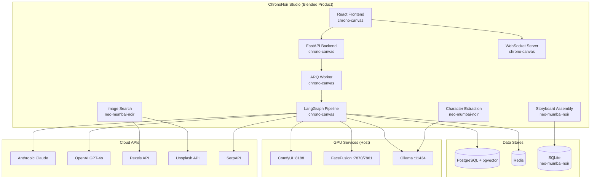

# Discovery Report: ChronoNoir Studio MVP

> Generated 2026-02-28 | Phase 1 Discovery

---

## Project A: chrono-canvas

**Path:** `/Users/riyer/code/chrono-canvas`
**Beads Prefix:** `history-faces`
**Existing Beads:** 17 (6 bugs, 5 features, 5 tasks, 1 in-progress)

### Tech Stack
| Layer | Technology | Version |
|-------|-----------|---------|
| Frontend | React + TypeScript + Vite | React 19, Vite 6, TS 5.7 |
| Backend | FastAPI (Python) | 0.115+ |
| Agent Orchestration | LangGraph | 0.2+ |
| Database | PostgreSQL + pgvector | 16 |
| Cache/Queue | Redis + ARQ | 7 |
| ORM | SQLAlchemy (async) + Alembic | 2.0 |
| LLM | Anthropic Claude, OpenAI, Ollama | claude-sonnet-4-5-20250929, gpt-4o, llama3.1:8b |
| Image Gen | ComfyUI (SDXL/FLUX) | via HTTP API |
| Face Swap | FaceFusion | port 7861 (Docker optional) |
| Semantic Search | sentence-transformers + pgvector | all-MiniLM-L6-v2 |
| State Management | Zustand | 5.0 |
| UI Components | Radix UI, Tailwind CSS | 4.0 |

### Infrastructure
- **Docker Compose** (dev + prod): PostgreSQL, Redis, API, Frontend (Nginx), optional FaceFusion
- **Kubernetes/GKE** manifests exist in `deploy/gke/` (StatefulSet, HPA, Ingress, ConfigMap, Secrets)
- **Makefile** with dev, build, test, migrate, seed, health targets
- **Networks:** frontend-net, db-net, worker-net, llm-net
- **Volumes:** pgdata, output, uploads

### API Endpoints (25+)
| Group | Key Endpoints |
|-------|--------------|
| Health | `GET /api/health` |
| Figures | CRUD `/api/figures`, `/api/timeline/figures` |
| Faces | `POST /api/faces/upload` (JPEG/PNG/WebP, 10MB max, magic bytes validation) |
| Generation | `POST /api/generate`, `GET /api/generate/{id}`, `/api/generate/{id}/images`, retry, feedback |
| Validation | `GET /api/validation/{id}` |
| Export | `GET /api/export/{id}/download`, `/api/export/{id}/metadata` |
| Agents | `GET /api/agents`, `/api/agents/llm-status`, `/api/agents/costs` |
| Admin | Validation rules CRUD, review queue (accept/reject/flag) |
| Memory | Cache stats, entries, clear |
| Eval | Runs, cases, dashboard |
| WebSocket | `WS /ws/generation/{request_id}` (real-time progress via Redis pub/sub) |

### Agent Pipeline (9 nodes, LangGraph)
1. Orchestrator → 2. Extraction → 3. Research → 4. Face Search → 5. Prompt Generation → 6. Image Generation → 7. Validation (score 0-100, retry if <70) → 8. Facial Compositing → 9. Export

### Database (PostgreSQL + pgvector)
10 tables: generation_requests, figures, generated_images, validation_results, feedback, audit_logs, research_cache (with vector embeddings), validation_rules, periods, admin_settings. 7 Alembic migrations.

### Key Capabilities
- Async generation pipeline with persistent run records
- LLM-judged validation with automatic retry
- Real-time WebSocket progress streaming
- Full audit trail (prompts, tokens, costs, latency per LLM call)
- Research caching with semantic similarity (pgvector)
- Face upload with magic-byte validation
- FaceFusion facial compositing
- Export (PNG + metadata JSON)
- Admin review queue (accept/reject/flag)
- Content moderation (keyword filtering)
- Multi-LLM routing with fallback chain

---

## Project B: neo-mumbai-noir

**Path:** `/Users/riyer/code/neo-mumbai-noir`
**Beads Prefix:** None (no beads DB initialized)
**Existing Beads:** 0

### Tech Stack
| Layer | Technology | Version |
|-------|-----------|---------|
| UI | Gradio | 4.x |
| Backend | Python | 3.11 |
| LLM | Ollama (llama3.2) | via HTTP API |
| Image Gen | ComfyUI (txt2img + img2img) | via HTTP + WebSocket |
| Face Swap | FaceFusion | port 7870 (custom HTTP server) |
| Image Search | Pexels API + Unsplash API | cloud |
| Database | SQLite | WAL mode |
| CV | OpenCV (headless) + ONNX Runtime | - |

### Infrastructure
- **Docker Compose**: single service `noir-pipeline` on port 7860
- **Dockerfile**: Python 3.11-slim, OpenCV system deps
- **start.sh / stop.sh**: orchestrates Ollama (11434), ComfyUI (8188), FaceFusion (7870), then Docker
- **Volume:** `noir-data` (persistent SQLite DB)
- **Host services** via `host.docker.internal`

### UI (Gradio, 7 tabs)
| Tab | Purpose |
|-----|---------|
| 0: Guide | Displays PRD/docs |
| 1: Story & Characters | Story input → Ollama extracts characters → saves to DB |
| 2: Image Search | Pexels + Unsplash search → download reference images |
| 3: Image Generation | ComfyUI txt2img + img2img with prompt customization |
| 4: FaceFusion | Single face swap + batch mode across scenes |
| 5: Storyboard | Assembles markdown storyboard from characters + scenes + images |
| 6: Gallery | Browse all outputs by type |

### Database (SQLite)
10 tables: schema_version, users, projects, stories, characters, scenes, search_queries, image_prompts, images, face_swaps. 3 views (characters_with_images, storyboard, image_gallery). Repository pattern with thread-safe connection manager.

### Key Capabilities
- Story text → character extraction (Ollama LLM)
- Search query generation from character descriptions
- Stock photo search (Pexels + Unsplash APIs)
- Smart image search (Ollama keyword extraction)
- ComfyUI txt2img portrait generation
- ComfyUI img2img style transfer
- FaceFusion face swapping (single + batch)
- Storyboard assembly (character + scene + image linking)
- Gallery browsing with type filtering
- Multi-user/multi-project support (DB schema)

### External Services
| Service | Port | GPU | Purpose |
|---------|------|-----|---------|
| Ollama | 11434 | Optional | Character extraction, prompt gen, keyword extraction |
| ComfyUI | 8188 | Required | txt2img/img2img generation |
| FaceFusion | 7870 | Required | Face consistency across scenes |
| Pexels | 443 (cloud) | No | Stock photo search |
| Unsplash | 443 (cloud) | No | Stock photo search |

---

## System Context Diagram

---

## Shared Dependencies & Conflicts

### Shared Services
| Service | chrono-canvas | neo-mumbai-noir | Resolution |
|---------|--------------|-----------------|------------|
| ComfyUI | Port 8188 (SDXL/FLUX) | Port 8188 (txt2img/img2img) | **Single instance** — same service, compatible workflows |
| Ollama | Port 11434 (llama3.1:8b) | Port 11434 (llama3.2) | **Single instance** — both models can coexist; route by model name |
| FaceFusion | Port 7861 (Docker optional) | Port 7870 (custom HTTP server) | **PORT CONFLICT** — different ports, different server implementations |

### Port Conflicts
| Port | chrono-canvas | neo-mumbai-noir | Conflict? |
|------|--------------|-----------------|-----------|
| 3000 | Frontend (Nginx) | — | No |
| 7860 | — | Gradio UI | No |
| 7861 | FaceFusion (Docker) | — | No |
| 7870 | — | FaceFusion (host HTTP server) | No |
| 8000 | FastAPI API | — | No |
| 8188 | ComfyUI | ComfyUI | Same service, no conflict |
| 11434 | Ollama | Ollama | Same service, no conflict |
| 5432 | PostgreSQL | — | No |
| 6379 | Redis | — | No |

### Database Strategy
| Project | DB | Issue |
|---------|-----|-------|
| chrono-canvas | PostgreSQL 16 + pgvector | Production-grade, async, migrations |
| neo-mumbai-noir | SQLite (WAL mode) | Lightweight, file-based, thread-safe |
| **Resolution** | Migrate neo-mumbai-noir data models into PostgreSQL | Neo's schema (characters, scenes, stories, images) maps cleanly to relational tables |

### Python Version
| Project | Version | Conflict? |
|---------|---------|-----------|
| chrono-canvas | 3.11 | No |
| neo-mumbai-noir | 3.11 | No — same version |

### LLM Provider Strategy
| Project | Providers | Conflict? |
|---------|-----------|-----------|
| chrono-canvas | Claude, OpenAI, Ollama (router with fallback) | No |
| neo-mumbai-noir | Ollama only | No — subsumes into chrono-canvas router |
| **Devpost requirement** | Must add Gemini | GAP in both projects |

### Env Var Conflicts
| Var | chrono-canvas | neo-mumbai-noir | Conflict? |
|-----|--------------|-----------------|-----------|
| OLLAMA_BASE_URL / OLLAMA_HOST | Different naming | Different naming | Minor — standardize to one |
| COMFYUI_API_URL / COMFYUI_HOST | Different naming | Different naming | Minor — standardize |
| FACEFUSION_API_URL / FACEFUSION_HOST | Different naming + port | Different naming + port | Standardize to single config |
